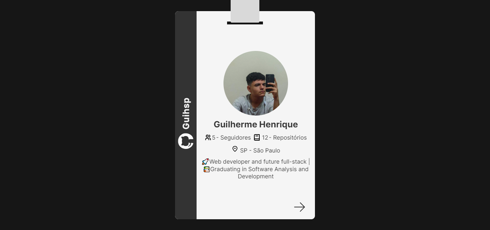

# GitHub Card 3D

[English version](#english-version) 

Um projeto simples e interativo que utiliza a API do GitHub para exibir informações do usuário em um card 3D. Desenvolvido com HTML5, CSS3 e JavaScript, este projeto oferece uma experiência visualmente atraente para apresentar dados do GitHub de forma única.

## Funcionalidades

- **Card 3D:** Uma apresentação visual em 3D, dividida em dois lados interativos.
- **Lado 1 - Perfil GitHub:** Exibe automaticamente informações do usuário do GitHub.
- **Lado 2 - Busca de Perfil:** Permite aos usuários fornecer seu username para buscar suas informações no GitHub usando a API do GitHub.

## Tecnologias Utilizadas

- HTML5
- Sass
- CSS3
- JavaScript

## Como Usar

1. Acesse a página do projeto [clicando aqui](https://github-card-3d.netlify.app/).
2. No lado 1 do card, suas informações do GitHub são automaticamente exibidas.
3. Gire o card para acessar o Lado 2, onde você pode fornecer seu username para buscar informações no GitHub.

## Armazenamento Local

Os dados do usuário são salvos localmente para garantir que as informações persistam mesmo após o fechamento do navegador.

## Demonstração

## Contribuições

Contribuições são bem-vindas! Sinta-se à vontade para abrir problemas ou enviar solicitações de pull.

## Licença

licenciado sob o [MIT license](LICENSE).

## English Version

## GitHub 3D Card

A simple and interactive project that uses the GitHub API to display user information on a 3D card. Developed with HTML5, CSS3, and JavaScript, this project offers a visually appealing experience to present GitHub data in a unique way.

## Features

- **3D Card:** A 3D visual presentation, divided into two interactive sides.
- **Side 1 - GitHub Profile:** Automatically displays GitHub user information.
- **Side 2 - Profile Search:** Allows users to provide their username to search for their information on GitHub using the GitHub API.

## Technologies Used

- HTML5
- Sass
- CSS3
- JavaScript

## How to Use

1. Access the project page [by clicking here](https://github-card-3d.netlify.app/).
2. On Side 1 of the card, your GitHub information is automatically displayed.
3. Flip the card to access Side 2, where you can provide your username to search for information on GitHub.

## Local Storage

User data is saved locally to ensure that the information persists even after the browser is closed.

## Demonstration

## Contributions

Contributions are welcome! Feel free to open issues or submit pull requests.

## License

Licensed under the [MIT license](LICENSE).